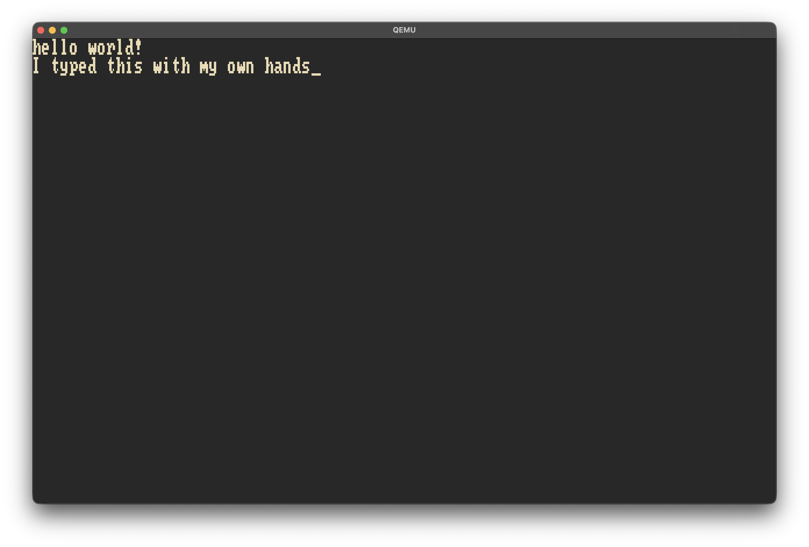

#+TITLE: ArcadeOS
#+OPTIONS: num:nil

* Rationale
Back when I was a wee lad (like 2020) I came across a certain YouTuber [[https://youtube.com/@jdh][@jdh]]. I've got to say, I really love
his content (wish he was back again), but after seeing his Tetris OS video I just felt like I had to try to do
something like that.

* Implementation Language(s)
I initially had written parts in C, but of course I had also heard about [[https://ziglang.org][Zig]], so I naturally decided to try
re-implementing the operating system in this pre-1.0 language (I was on the "Rust evil" train back then,
mostly as a result of a major skill issue on my part after trying to use it without learning it first). I made
decent progress but stalled after needing to refactor for I think it was 0.15, as well as another issue.

* Process
I started with a =C= basis using the [[https://github.com/Limine-Bootloader/Limine][Limine Bootloader]] instead of grub because "I wanted to do it the right way".
Naturally thus I also went straight to 64-bit mode, but didn't want to bother with proper mapping at this point
and just did an identity map (not really the "right way" but whatever). I actually go all the way to SMP
multiprocessing but didn't do much before I got nerd-sniped by Zig, so I started the rewrite process.

This time I did a bit better with the paging and page frame accounting, designing a Buddy Allocator as wel
as doing the recursive page mapping trick to only map what I needed. Unfortunately at this point I started
attempting to setup keyboard input, and for whatever reason it decided that this was a Bad Idea. So naturally
if I press buttons too quickly it crashes, and I could not figure out how. We were getting heap corruption,
but it was never triggering any of the points it should be, so I took a ~6 month break. Also unfortunately, during
this time Zig released a new version (0.15 I think) and I got bogged down trying to refactor to the new version.
Don't get me wrong, I think they were good changes, but I simply did not want to bother with fixing this up.

If I have more time I would love to commit to improving it so it actually works.

* Goals
I really just wanted to work on low-level programming, but that's not the direct goal here. I wanted to make a
project that could (by its name) function as a sort of arcade operating system, with simple 8-bit style games on
it that you would "insert" with a secondary USB, while storing the kernel and save data on the main USB. I really
just miss the Wii style system from before, and was modelling it (loosely) off of that. It was intended to have
a higher privelege "menu" from which you would launch games, that while they were playing they would be the
only thing running on the CPU, although of course having library functions for priveleged code such as IO.

