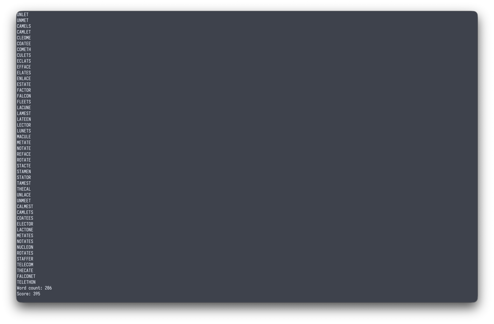

#+TITLE: Boggle Solvers
#+OPTIONS: num:nil

* Languages
I initially started this as a way to just implement the same thing in a ton of languages.
I had planned to do an implementation in a language for each letter of the alphabet, but
so far I have only gotten around to writing ones for Haskell, Go, and Rust.

* Process
I might have had the most fun with the Haskell version. Being forced to use a purely functional
language is an interesting experience. I definitely prefer the functional chain approach that
Rust uses over =$= operator that Haskell uses since I find reading top down a bit easier than
right to left like the Haskell one kinda ends up being, but I perhaps should be doing smaller
lines so that might be on me. Regardless, I really appreciated the strong typing approach that
both of them provide with pattern matching, and the implementations themselves weren't really
too bad, although I played around with data types in Haskell maybe a bit too long.

* Usage
You provide a text file of the board to stdin and have a copy of the dictionary at =./dictionary.txt=.
The reason for a fairly uniform layout is for benchmarking my implementations, making sure I get
the same values, etc.

