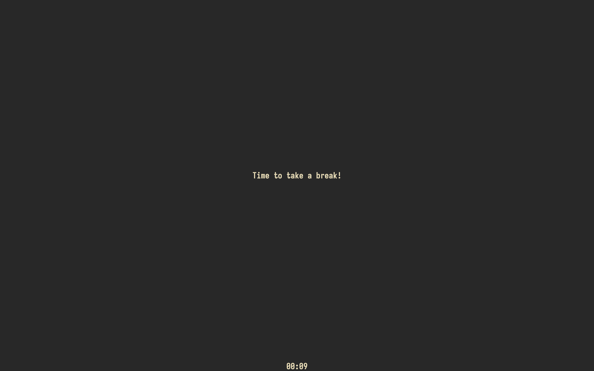

#+TITLE: Breaktime

* Motivation
I can spend many hours in a row in front of the computer, and that is not good for anyone
for a variety of reasons: not drinking water, being sedentary, and poor eye health. I have
tried using pomodoro timers before but I find myself far more likely to just be like "let me
just finish this one thing and then I'll break", and then never end up breaking. This one
functions differently in that it throws up a popup over my entire screen when it's my break
time.

* Implementation
I of course chose possibly one of the more cursed techniques for this, in that I did the UI
in Swift but put the initial loading code in Zig for some reason (don't ask me, as 2024 me).
It somehow works regardless, which honestly is quite the acheivement for the Zig team that
their C interoperability just works this well.

* Usage
Running the binary will pop up the window, and then every =x= minutes (default =15=) take a =y=
minute (default =5=) break. During this time there is a full screen popup (which admittedly
you can just =Cmd-TAB= away from) that will go away during work sessions. It is configurable
with a JSON file.

(Yes that is the whole screen)
