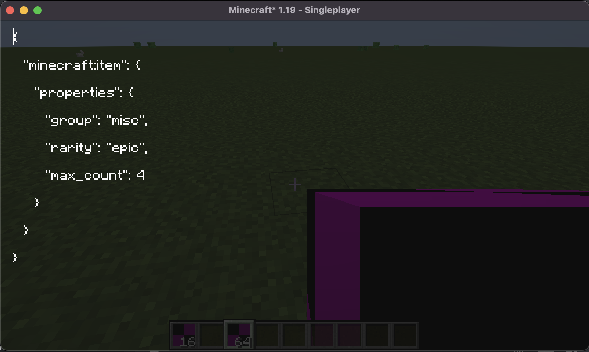

#+TITLE: Datapack++

#+OPTIONS: num:nil

* Motivation
I wanted to extend the datapacking system of the Java Edition of Minecraft to support
custom blocks, items, etc. back a few years ago when I was soldily in my modding phase.
This would be useful feature since it enables easier development for those who simply want
to be creators without coding. You of course will always be limited when you can't code,
but you can still acheive a pretty high degree flexibility. Also, I had been into modding
for a while but lack a bit of creativity, so I instead focused on something that was purely
technical. Recently Mojang has begun to, in my guesstimation, get close to ideas such as
this as they have been revamping the system but they haven't gotten quite here yet
(although I can't lie, my implemenation could be buggy at times).

* Implementation
This may have been some of the hackiest code I have ever written, I was writing a ton of
[[https://github.com/SpongePowered/Mixin][Mixins]] to be able to patch into registries and such, but it worked surprisingly well. I was
able to have hot reloading of items and blocks with the =/reload= command without crashing,
and you could add items this way. It could be worth it to try cleaning it up a bit for modern
Minecraft, it would still be relevant. Other than the mixins though it was just a bunch of figuring
out how exaclty I wanted to serialize stuff. It forced me into using Codecs which really helped
me start to grasp functional style programming, but I must say, the [[https://github.com/Mojang/DataFixerUpper][DFU]] library is possibly
one of the most cursed things I've seen in production; I mean look at =src/main/java/com/mojang/datafixers/util/Function16.java=,
you can't tell me that that is a good piece of code, but I guess that's what we get for Java's
implementation of functional programming.

* Intended usage
As a mod, this simply could be dropped in the mods folder (Fabric mod loader FTW) and you would
then be able to put items and blocks with custom properties from =Item.Properties= or =Block.Properties=
into your datapack structure and it would just work. It was honestly pretty surreal seeing the items
get patched in real time and working just fine. I never got around to making a proper gui rather than
editing the json raw, but that would be the next thing I would have worked on, being able to create
an item and then attach capabilities to it sort of how the current datapack layout stuff works.

