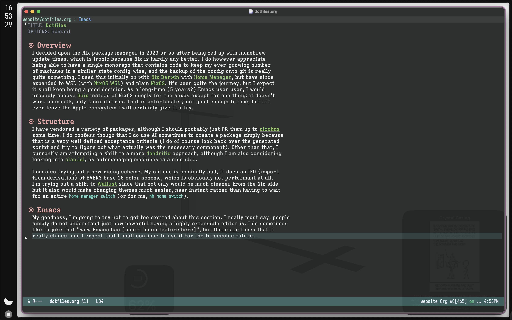

#+TITLE: Dotfiles
#+OPTIONS: num:nil

* Overview
I decided upon the Nix package manager in 2023 or so after being fed up with homebrew
update times, which is ironic because Nix is hardly any better. I do however appreciate
being able to have a single monorepo that contains code to keep my ever-growing number
of machines in a similar state config-wise, and the backup of the config onto git is really
quite something. I used this initially on with [[https://github.com/nix-darwin/nix-darwin][Nix Darwin]] with [[https://github.com/nix-community/home-manager][Home Manager]], but have since
expanded to WSL (with [[https://github.com/nix-community/NixOS-WSL][NixOS WSL]]) and plain [[https://nixos.org][NixOS]]. It's been quite the journey, but I expect
it shall keep being a good decision. As a long-time (5 years?) Emacs user user, I would
probably choose [[https://guix.gnu.org][Guix]] instead of NixOS simply for the sexps except for one thing: it doesn't
work on macOS, only Linux distros. That is unfortunately not good enough for me, but if I
ever leave the Apple ecosystem I will certainly give it a try.

* Structure
I have vendored a variety of packages, although I should probably just PR them up to [[https://github.com/nixos/nixpkgs][nixpkgs]]
some time. I do confess though that I do use AI sometimes to create a package simply because
that is a very well defined acceptance criteria (I do of course look back over the generated
script and try to figure out what actually was the necessary component). Other than that, I
currently am attempting a shift to a more [[https://discourse.nixos.org/t/the-dendritic-pattern/61271][dendritic]] approach, although I am also considering
looking into [[https://clan.lol][clan.lol]], as automanaging machines is a nice idea.

I am also trying out a new ricing scheme. My old one is comically bad, it does an IFD (import
from derivation) of EVERY base 16 color scheme, which is obviously not performant at all.
I'm trying out a shift to [[https://codeberg.org/explosion-mental/wallust][Wallust]] since that not only would be much cleaner from the Nix side
but it also would make changing themes much easier, near instant rather than having to wait
for an entire =home-manager switch= (or for me, =nh home switch=).

* Emacs
My goodness, I'm going to try not to get too excited about this section. I really must say, people
simply do not understand just how powerful having a highly extensible editor is. I do sometimes
like to joke that "wow Emacs has [insert basic feature here]", but there are times that it
really shines, and I expect that I shall continue to use it for the forseeable future.

